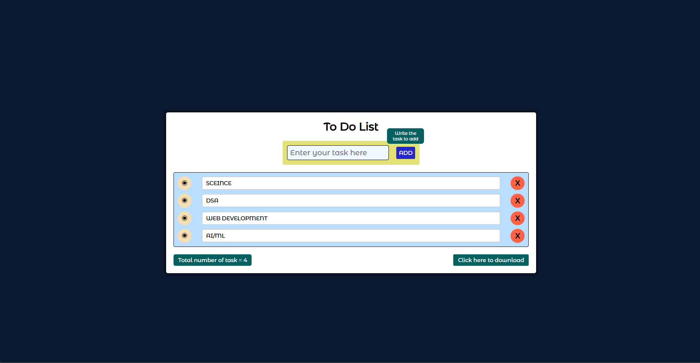

# To-Do List Project

A simple and elegant To-Do List application that helps you organize and manage your daily tasks efficiently.

## Features
- **Add Tasks**: Add new tasks to your to-do list.
- **Delete Tasks**: Remove tasks from the list.
- **User-Friendly Design**: Clean and intuitive UI design for ease of use.

## Files in the Project
- `index.html` - The main HTML structure of the application.
- `style.css` - Stylesheet for the application's layout and design.
- `app.js` - JavaScript functionality for the To-Do List.
- `MontserratAlternates-Medium.otf` - Font file used for the application's design.

## Getting Started
1. Clone this repository to your local machine:
   ```bash
   git clone https://github.com/your-username/ToDoList.git
   ```
2. Open the `index.html` file in your browser to use the application.

## How to Use
1. Open the application in a browser.
2. Type a task into the input field and press **Enter** to add it to the list.
3. Use the X button to remove tasks.

## Preview



## Technologies Used
- HTML
- CSS
- JavaScript

## Font
- [Montserrat Alternates](https://fonts.google.com/specimen/Montserrat+Alternates)

## License
This project is licensed under the MIT License. You are free to use, modify, and distribute it.

---

*Created with ❤️ by [Satyam](https://github.com/your-username).*
